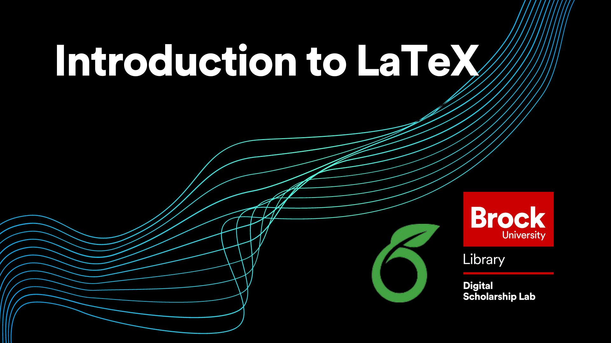

# Introduction to LaTeX using Overleaf
LaTeX is a typesetting system that is often used to write technical or scientific documents. LaTeX is able to nicely render complex mathematical formulas and other special symbols easily. Unlike other document creation software like Word, LaTeX handles the majority of the styling of the document automatically, so you can focus on your content and not have to worry about how it will look on the page.

In this workshop, we'll cover the basics of document creation in LaTeX (including basic text editing, adding tables, figures and lists, use of templates and BibTeX for citations and bibliographies) using the free online tool [Overleaf](https://www.overleaf.com/). 

No prior experience is necessary!

## Setup Instructions
In preparation for this workshop, you will need the following:
-  a free Overleaf account. You can register for Overleaf [here](https://www.overleaf.com/register).
- an image file to insert into your document (we'll be using this as an example of a figure, so just about any image will do)
- the IEEE LaTeX conference template, which can be downloaded as a .zip file from [this IEEE website](https://www.ieee.org/conferences/publishing/templates.html) by clicking the on the "Template" link under the "LaTeX Template Instructions" subheading. If you are not able to download the .zip file, we will also cover how to load templates from within Overleaf itself. 

## Helpful Materials
[Detexify](https://detexify.kirelabs.org/classify.html) is a helpful site for finding the LaTeX commands for particular symbols (for example if you don't remember how to write the symbol for pi)

[TablesGenerator](https://www.tablesgenerator.com/) is a great resource for easily creating tables in LaTeX

[List of Greek letters and math symbols](https://www.overleaf.com/learn/latex/List_of_Greek_letters_and_math_symbols) is a helpful reference for writing equations

The [Overleaf Help Documentation](https://www.overleaf.com/learn) is a fantastic resource for almost any question you could have about writing LaTeX documents in Overleaf. Some particularly helpful pages for what we cover in this workshop are:
- [Mathematical expressions](https://www.overleaf.com/learn/latex/Mathematical_expressions) as a reference for mathmode
- [Inserting images](https://www.overleaf.com/learn/latex/Inserting_Images) as a reference for adding figures
- [Positioning of Figures](https://www.overleaf.com/learn/latex/Positioning_of_Figures) as a reference for positioning figures (and other items like tables!)
- [Algorithms](https://www.overleaf.com/learn/latex/Algorithms) as a reference for typesetting pseudocode
- [BibTeX styles](https://www.overleaf.com/learn/latex/Bibtex_bibliography_styles) and guide to [bibliography management with BibTeX](https://www.overleaf.com/learn/latex/Bibliography_management_with_bibtex)

  
**This workshop is brought to you by the Brock University Digital Scholarship Lab.  For a listing of our upcoming workshops go to [Experience BU](https://experiencebu.brocku.ca/organization/dsl) if you are a Brock affiliate or [Eventbrite page](https://www.eventbrite.ca/o/brock-university-digital-scholarship-lab-21661627350) for external attendees.**

<!--- Please use reference style images so that it is easier to update pictures later --->

